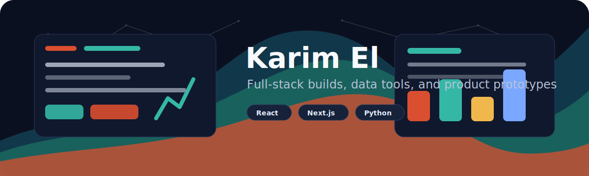

  

<h1 align="center">Hi, I'm Karim</h1>

  I build full-stack web apps, civic-service prototypes, data tools, and trading/automation experiments.
  I like turning rough product ideas into usable interfaces with clean flows and practical engineering.

  
  

---

### What I Work On

- Product-focused web apps with **Next.js**, **React**, **TypeScript**, and **Tailwind CSS**
- Multi-step service flows, dashboards, content platforms, and responsive frontends
- Python tools for market data, automation, scraping, dashboards, and AI-assisted workflows
- Fast prototypes that can become real products after validation

### Tech Stack

  
  
  
  
  
  
  
  
  
  
  
  

### Featured Projects

| Project | What it is | Stack |
| --- | --- | --- |
| [Mowatin-](https://github.com/Karim3l/Mowatin-) | Civic-service product prototype with polished app flows and bilingual public-service UX. | Next.js, React, Tailwind, Radix UI |
| [futudurable](https://github.com/Karim3l/futudurable) | Content/news platform with SEO routes, lead capture, and CMS-style article rendering. | Next.js, TypeScript, Tailwind, React |
| [nof1.ai-Version1](https://github.com/Karim3l/nof1.ai-Version1) | Hyperliquid market-data and trading research bot with wallet/testnet integrations and dashboard experiments. | Python, Streamlit, Pandas, Hyperliquid SDK |

### Current Focus

- Shipping cleaner product interfaces with better onboarding and form flows
- Building data-driven tools around market data and automation
- Improving reusable frontend systems with accessibility-minded components
- Turning prototypes into maintainable, deployable applications

### GitHub Snapshot

  
  

---

  <strong>Building useful software, one practical release at a time.</strong>

