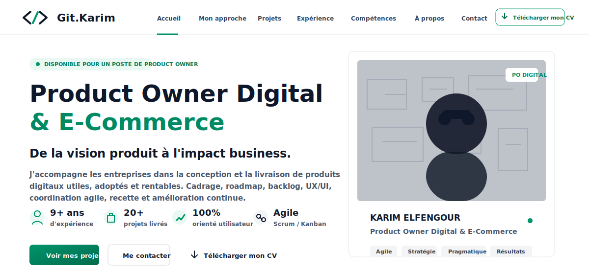
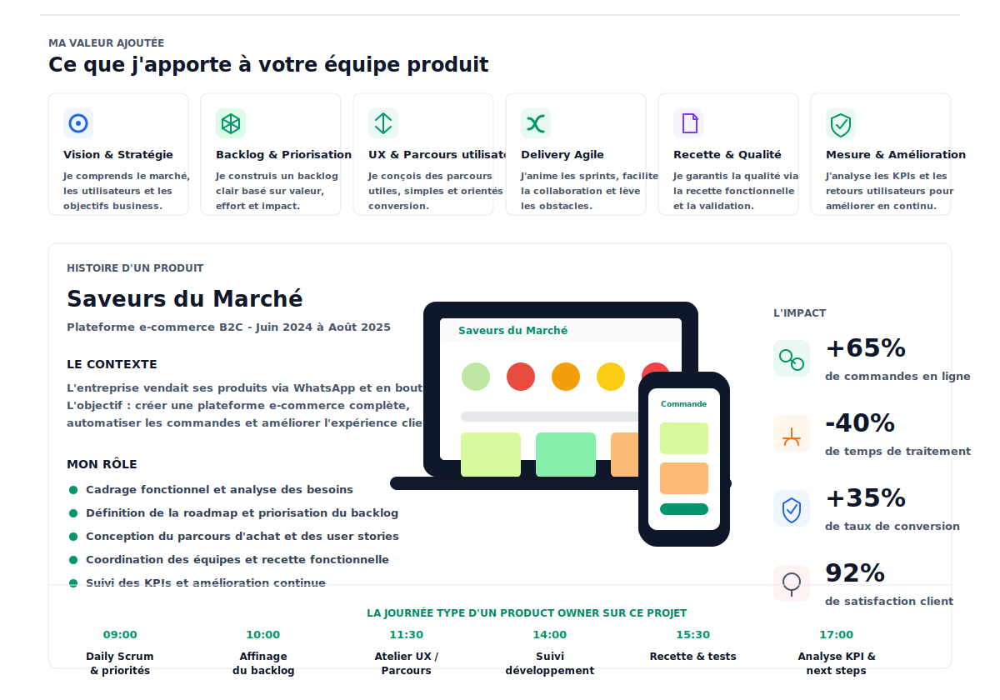
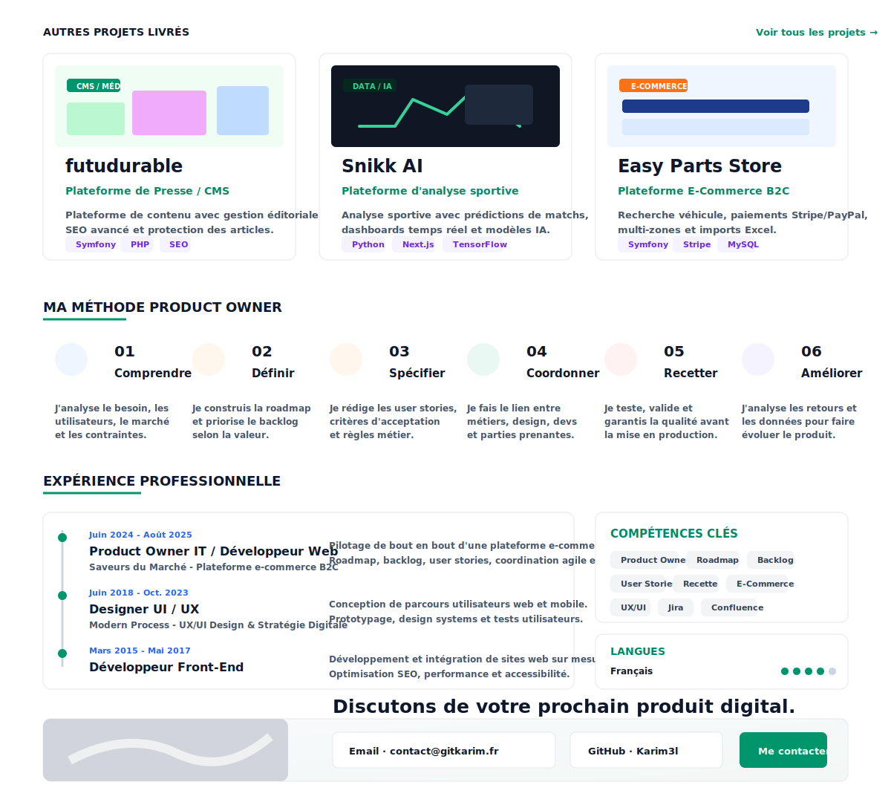

  

  
  
  

  Product Owner Digital & E-Commerce avec une forte culture technique.
  Je transforme les besoins métier en produits utiles, livrables et mesurables.

  

  

### Projets

| Produit | Positionnement | Stack / rôle |
| --- | --- | --- |
| [futudurable](https://futudurable.com/) | Plateforme de presse / CMS avec gestion éditoriale, SEO avancé, commentaires et protection des articles. | Symfony, PHP, Twig, MySQL, SEO |
| [Snikk AI](https://snikkai.com/) | Plateforme d'analyse sportive avec prédictions de matchs, dashboards temps réel et approche data/IA. | Python, Next.js, PostgreSQL, TensorFlow |
| [Easy Parts Store](https://easypartsgermany.fr/) | Plateforme e-commerce B2C avec recherche véhicule, multi-zones, paiements et import Excel. | Symfony, Stripe, PayPal, MySQL |

### Compétences

`Product Owner` `Roadmap` `Backlog` `User Stories` `Recette` `E-Commerce` `Marketplace` `CMS` `API & Intégrations` `UX/UI` `Analyse fonctionnelle` `Jira` `Confluence`

### GitHub

  
  

  <strong>Discutons de votre prochain produit digital.</strong> 
  <a href="mailto:contact@gitkarim.fr">contact@gitkarim.fr</a> ·
  <a href="https://gitkarim.fr">gitkarim.fr</a> ·
  <a href="https://github.com/Karim3l">github.com/Karim3l</a>

